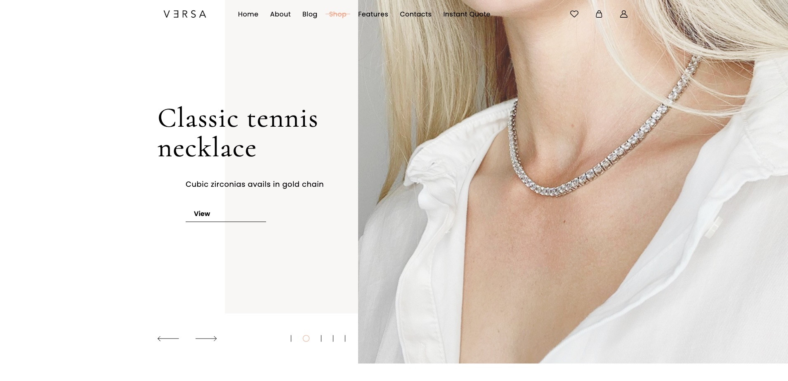

# Jewelry Store

Multi-page responsive jewelry store website built from a Figma design.

## Technologies

* HTML5
* SCSS
* Flexbox
* CSS Grid
* BEM Methodology

## Pages

* Home Page
* Shop Page
* Product Page
* Cart Page
* Contacts Page
* Blog Page
* Article Page

## Features

* Responsive design for desktop, tablet, and mobile devices
* Semantic HTML markup
* Multi-page website structure
* Reusable UI components
* SCSS architecture with variables and mixins
* Responsive product catalog and product gallery
* Breadcrumb navigation
* Blog and article layouts
* Hover and focus states
* Consistent UI design across all pages
* Optimized project structure

## Project Preview

## Live Demo

https://jewelry-store-flame-nine.vercel.app/

## Repository

https://github.com/KamDiaV/jewelry-store